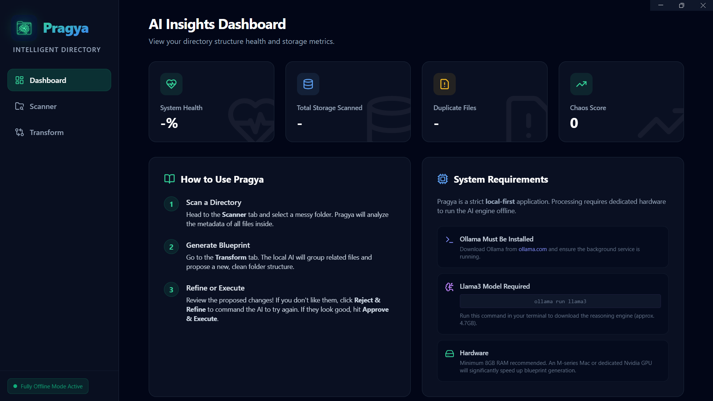
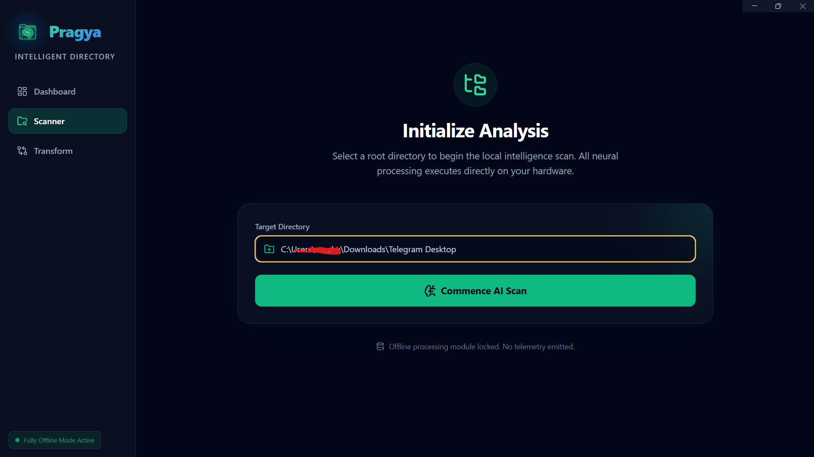
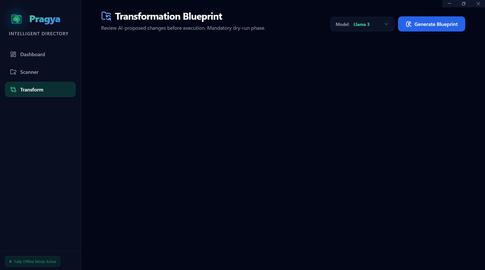

<div align="center">
  
  <h1>Pragya - Intelligent Directory Manager</h1>
</div>

Pragya is a strict, local-first AI application built with Electron and React. It uses **Ollama** running locally on your hardware to analyze messy directories and generate an organized file structure blueprint without ever sending your data to the cloud. Designed with a sleek, glassmorphic dark-mode interface, it helps you conquer digital chaos securely and beautifully.

## System Prerequisites

To use Pragya, you MUST have [Ollama](https://ollama.com/) installed and running on your device.
You also need to pull the models required for generation. Open your terminal and run:
```bash
ollama run llama3
ollama run nomic-embed-text
```

```markdown
**(Optional)** You can also pull other supported models like `mistral` or `llama3.2`. Note that if you select any of these models in the application without installing them first, you will encounter errors.
```

---

## 🚀 Running Pragya Locally (Development)

First, install the Node.js dependencies:
```bash
npm install
```

### Windows
1. Ensure Ollama is running in your system tray.
2. Open a terminal (PowerShell or Command Prompt) in the project directory.
3. Run: `npm run electron:dev`

### macOS
1. Start the Ollama application from your Applications folder (you should see the llama icon in your menu bar).
2. Open your Terminal.
3. Run: `npm run electron:dev`

### Linux (Ubuntu)
1. Install Ollama via curl: `curl -fsSL https://ollama.com/install.sh | sh`
2. Ensure the systemd service is active: `sudo systemctl status ollama`
3. Open a terminal in the project directory.
4. Run: `npm run electron:dev`

---

## 📦 Building the Installer (Production)

To compile Pragya into a standalone executable (e.g., an `.exe` for Windows):

```bash
npm run electron:build
```
This will output the compiled installer into the `dist-electron/` folder inside the project.

---

## 📖 Walkthrough & Usage Guide

Pragya is designed to be intuitive but enforces a strict "Dry Run" philosophy to prevent accidental data loss.

### 1. The Dashboard
When you launch Pragya, you'll be greeted by the Dashboard. This provides an overview of the application's capabilities, explicitly confirms that the application is running completely offline, and reminds you of the system hardware and model requirements.

*(Add Dashboard Screenshot here)*
``

### 2. Scanning a Directory
Navigate to the **Scanner** tab. Select a messy, unorganized root folder on your computer. Pragya will recursively map all files within this folder, calculate a Chaos Score based on file disorganization, and prepare a lightweight structure map to send to the local AI.

*(Add Scanner Screenshot here)*
``

### 3. Transformation & Model Selection
Once scanned, go to the **Transform** tab. Here, you define the brains of the operation:
- Select your preferred model from the themed dropdown (e.g., `Llama 3`, `Mistral`).
- Click **Generate Blueprint**.
- The AI will analyze the file paths and propose an elegant, logical folder structure. 

Crucially, **Pragya will never randomly rename your files**, and files that are already in good, logically named folders are completely ignored to avoid unnecessary churn.

*(Add DiffViewer/Blueprint Screenshot here)*
``

### 4. Blueprint Rejection & Refinement
Not happy with the proposed structure? Rather than being forced to accept it, you can click **Reject & Refine Blueprint**. A text area appears where you can literally just type what you want changed:
> *"I don't like grouping by file extension. Group by the year the file was created instead."*

Hit **Regenerate**, and the AI will create a brand new blueprint respecting your custom rules!

*(Add Refinement Screenshot here)*
``

### 5. Execution Engine & Rollback
Finally, when you approve the blueprint, hit **Approve & Execute**. The internal engine rapidly moves the files locally on your file system, keeping a database transaction log of every single move. 

If something goes wrong (e.g., you realize you moved a file you shouldn't have), you can instantly click **Undo & Rollback**. Pragya reads the transaction log and perfectly restores your files to the exact paths they were located in before the execution began!

Once you're satisfied, click **Complete & Start Over** to clear the session and jump right back to the Dashboard.

*(Add Execution Log Screenshot here)*
``

---

## 📸 Screenshots

| Dashboard | Scanner |
| :---: | :---: |
|  |  |

| Blueprint | Refinement |
| :---: | :---: |
|  


---

## 🛠️ Tech Stack

- **Framework**: [Electron](https://www.electronjs.org/) & [React](https://react.dev/)
- **Styling**: [Tailwind CSS](https://tailwindcss.com/)
- **AI Engine**: [Ollama](https://ollama.com/) (Local LLM)
- **Database**: [SQLite](https://www.sqlite.org/) (for transaction logging and rollbacks)
- **Icons**: [Lucide React](https://lucide.dev/)

